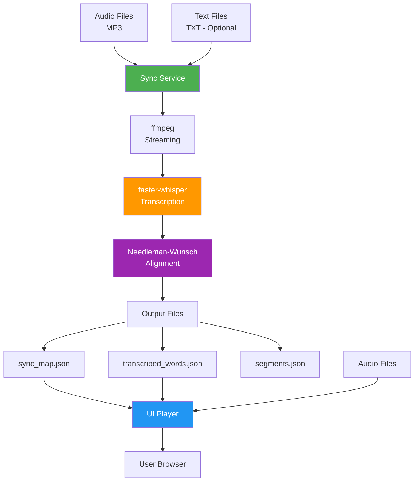

# Lumi - Audiobook to Text Synchronization System
## Complete Design Documentation & Command Reference

---

## Table of Contents

1. [Overview](#overview)
2. [System Architecture](#system-architecture)
3. [Component Details](#component-details)
4. [Setup & Installation](#setup--installation)
5. [Running the Application](#running-the-application)
6. [Data Flow & Processing Pipeline](#data-flow--processing-pipeline)
7. [File Structure](#file-structure)
8. [Technology Stack](#technology-stack)

---

## Overview

**Lumi** is a sophisticated audiobook synchronization system that aligns audio narration with text at word-level precision. The system consists of two main components:

- **Sync Service**: A Python-based audio transcription and alignment engine
- **UI Player**: A web-based audiobook player with real-time text highlighting

### Key Features

- **Word-Level Synchronization**: Precise highlighting of words as they're spoken
- **Memory-Efficient Streaming**: Handles large audiobooks (10+ hours) without memory issues
- **Multi-Book Library**: Support for multiple audiobooks with progress tracking
- **Interactive Navigation**: Click any word to jump to that position in audio
- **Automatic Transcription**: Process audiobooks with or without ground-truth text
- **Persistent State**: Saves playback position and preferences per book

---

## System Architecture



### Architecture Overview

The system uses a **two-stage pipeline**:

1. **Sync Service (Backend)**: Processes raw audiobook files to generate synchronization data
2. **UI Player (Frontend)**: Consumes sync data to provide an interactive reading/listening experience

---

## Component Details

### 1. Sync Service (`sync_service/main.py`)

The core transcription and alignment engine.

#### Purpose
Transcribes audio files and aligns them with text using AI-powered speech recognition.

#### Key Technologies
- **faster-whisper**: 4x faster than OpenAI Whisper, provides word-level timestamps
- **ffmpeg**: Streams audio in chunks to avoid memory overflow
- **Needleman-Wunsch Algorithm**: Aligns transcribed text with ground truth

#### Processing Modes

**Mode 1: With Ground Truth Text** (Recommended)
- Input: `.mp3` + `.txt` files
- Process: Transcribe → Align with provided text → Generate sync map
- Output: Highly accurate timestamps mapped to original text structure

**Mode 2: Transcription Only**
- Input: `.mp3` file only
- Process: Transcribe → Use transcription as ground truth
- Output: Generated text with timestamps

#### Architecture Innovations

**Memory Optimization**
- Audio streamed in 1-hour chunks via `ffmpeg`
- Producer-Consumer pattern: Next chunk prefetches while current processes
- Int16 matrix for Needleman-Wunsch (vs Int64) reduces memory by 75%

**Windowed Search Algorithm**
- Uses 3x search window for alignment (adjustable)
- Processes segments sequentially with cursor tracking
- Prevents O(n²) complexity for long audiobooks

#### Output Files

| File | Purpose | Size (typical) |
|------|---------|----------------|
| `{book}_sync_map.json` | Paragraph ID → start/end timestamps | ~1 MB |
| `{book}_transcribed_words.json` | Every word with timestamps | ~20 MB |
| `{book}_segments.json` | Paragraph structure from ground truth | ~2 MB |

---

### 2. UI Server (`ui/server.py`)

A lightweight HTTP server with custom range request support.

#### Purpose
Serves the web player and handles audio streaming with seek support.

#### Key Features

- **HTTP Range Requests**: Critical for audio seeking (allows jumping to any position)
- **Book Discovery API**: `/api/books` endpoint lists available audiobooks
- **Smart Caching**:
  - Static files (`.mp3`, `.json`): 1 year cache (immutable)
  - Code files (`.html`, `.js`, `.css`): 1 hour cache
- **Graceful Port Handling**: Auto-switches to 8001 if 8000 is busy
- **Error Suppression**: Ignores benign client disconnection errors

#### API Endpoints

| Endpoint | Method | Description |
|----------|--------|-------------|
| `/api/books` | GET | Returns list of available books (books with all required files) |
| `/{path}` | GET | Serves static files with range support |

---

### 3. UI Player (`ui/index.html` + `ui/app.js`)

An interactive web-based audiobook player.

#### UI Components

**Player Controls**
- HTML5 audio player with standard controls (play/pause/seek/volume)
- Book selector dropdown (populated from `/api/books`)
- Font size controls (+/-)

**Text Display**
- Renders text as individual word spans for granular highlighting
- Smooth auto-scrolling to keep active word centered
- Click any word to seek audio to that position

#### Technical Features

**Performance Optimizations**
- **Chunked Rendering**: Only renders 50 paragraphs at a time
- **Binary Search**: O(log n) lookup for active word
- **Virtual Scrolling**: Dynamically loads chunks as playback progresses

**State Management**
- Book-specific storage keys: `lumi_{book}_last_time`
- Persists: playback position, selected book, font size
- Throttled saves (1 second interval) to reduce localStorage writes

**Event Handling**
- `timeupdate`: Updates highlight 60 times/second (browser default)
- `seeked`: Immediately updates highlight on manual seek
- `pause`: Saves exact position
- Event delegation for word clicks (single listener for all words)

#### Synchronization Logic

```javascript
// Pseudo-code for sync algorithm
1. On timeupdate:
   - Get audioPlayer.currentTime
   - Binary search sortedParagraphs for active paragraph
   - Check if paragraph is in current chunk, else render new chunk
   - Binary search visible word spans for active word
   - Apply .active-word class
   - Scroll active word into view
```

---

## Setup & Installation

### Prerequisites

- **Python 3.8+**
- **ffmpeg** and **ffprobe** (must be in system PATH)
- **CUDA-capable GPU** (optional, but recommended for faster transcription)

### Installation Steps

#### 1. Clone/Navigate to Project
```bash
cd c:\Code\Lumi
```

#### 2. Create Virtual Environment
```bash
python -m venv .venv
```

#### 3. Activate Virtual Environment

**Windows (PowerShell):**
```powershell
.\.venv\Scripts\Activate.ps1
```

**Windows (CMD):**
```cmd
.venv\Scripts\activate.bat
```

**Linux/Mac:**
```bash
source .venv/bin/activate
```

#### 4. Install Dependencies
```bash
pip install -r sync_service\requirements.txt
```

> **Note**: `faster-whisper` will automatically download model files on first run (~1-3 GB depending on model size)

#### 5. Verify ffmpeg Installation
```bash
ffmpeg -version
ffprobe -version
```

If not installed:
- **Windows**: Download from [ffmpeg.org](https://ffmpeg.org/download.html) and add to PATH
- **Mac**: `brew install ffmpeg`
- **Linux**: `sudo apt install ffmpeg`

---

## Running the Application

### Quick Start (Complete Workflow)

#### Step 1: Prepare Your Audiobook

Place files in the `data` folder:
```
c:\Code\Lumi\data\
  ├── my_audiobook.mp3
  └── my_audiobook.txt  (optional, but recommended for accuracy)
```

#### Step 2: Process the Audiobook (Sync Service)

**Basic Command (Tiny Model - Fastest)**
```bash
python sync_service\main.py --model-size tiny
```

**Recommended Command (Base Model - Good Balance)**
```bash
python sync_service\main.py --model-size base
```

**High Accuracy Command (Large Model - Slow but Accurate)**
```bash
python sync_service\main.py --model-size large-v3
```

**Full Options:**
```bash
python sync_service\main.py ^
  --data-dir data ^
  --output-dir sync_service\output ^
  --model-size base ^
  --device cuda ^
  --compute-type int8_float16
```

> **Processing Time Estimates** (10-hour audiobook on RTX 3080):
> - `tiny`: ~30 minutes
> - `base`: ~1 hour
> - `small`: ~2 hours
> - `medium`: ~4 hours
> - `large-v3`: ~8 hours

#### Step 3: Copy Output Files to UI Data Folder

After processing completes, copy the generated files:
```bash
copy sync_service\output\*.json ui\data\
copy sync_service\output\*.mp3 ui\data\
```

Or manually copy:
- `{book}_sync_map.json`
- `{book}_transcribed_words.json`
- `{book}_segments.json`
- `{book}.mp3`

#### Step 4: Start the UI Server
```bash
python ui\server.py
```

Expected output:
```
Serving at http://localhost:8000
Open your browser and navigate to http://localhost:8000
Range requests enabled for audio seeking
```

#### Step 5: Open in Browser

Navigate to: **http://localhost:8000**

---

## Command Reference

### Sync Service Commands

#### Basic Commands

| Command | Description | Use Case |
|---------|-------------|----------|
| `python sync_service\main.py` | Process with default settings (large-v2, auto-detect device) | General use |
| `python sync_service\main.py --model-size tiny` | Fastest processing, lower accuracy | Quick testing |
| `python sync_service\main.py --model-size base` | Good balance of speed and accuracy | Recommended for most users |
| `python sync_service\main.py --model-size large-v3` | Best accuracy, slowest | Professional/production use |

#### Advanced Options

| Option | Values | Default | Description |
|--------|--------|---------|-------------|
| `--data-dir` | Path | `data` | Directory containing `.mp3` and `.txt` files |
| `--output-dir` | Path | `sync_service/output` | Where to save output JSON files |
| `--model-size` | `tiny`, `base`, `small`, `medium`, `large-v2`, `large-v3` | `large-v2` | Whisper model size |
| `--device` | `cuda`, `cpu` | Auto-detect | Force CPU or GPU processing |
| `--compute-type` | `int8`, `int8_float16`, `float16`, `float32` | `int8_float16` | Precision vs speed trade-off |

#### Example Commands

**CPU-Only Processing (No GPU)**
```bash
python sync_service\main.py --model-size base --device cpu --compute-type int8
```

**Maximum Accuracy (GPU Required)**
```bash
python sync_service\main.py --model-size large-v3 --device cuda --compute-type float16
```

**Process Custom Data Directory**
```bash
python sync_service\main.py --data-dir "D:\My Audiobooks" --output-dir "D:\Output"
```

**Quick Test Run**
```bash
python sync_service\main.py --model-size tiny --device cpu
```

---

### UI Server Commands

#### Basic Command
```bash
python ui\server.py
```

#### Alternative Ports
The server automatically tries port 8001 if 8000 is busy, but you can modify `ui\server.py`:

```python
PORT = 8080  # Change to any available port
```

#### Testing Server is Running
```bash
curl http://localhost:8000/api/books
```

Expected response: `["book1", "book2", ...]`

---

## Data Flow & Processing Pipeline

### Stage 1: Audio Processing (Sync Service)


**Output**: `transcribed_words.json`
```json
[
  {"word": " The", "start": 0.12, "end": 0.34, "score": 0.99},
  {"word": " quick", "start": 0.35, "end": 0.67, "score": 0.98}
]
```

### Stage 2: Text Alignment (Sync Service)


**Output**: `sync_map.json`
```json
{
  "p1": {"start": 0.12, "end": 5.67},
  "p2": {"start": 5.80, "end": 12.34}
}
```

### Stage 3: UI Playback


---

## File Structure

```
c:\Code\Lumi\
│
├── sync_service/              # Backend transcription service
│   ├── main.py                # Main entry point
│   ├── requirements.txt       # Python dependencies
│   ├── output/                # Generated sync files
│   │   ├── {book}_sync_map.json
│   │   ├── {book}_transcribed_words.json
│   │   └── {book}_segments.json
│   └── tests/                 # Unit tests
│
├── ui/                        # Frontend web player
│   ├── index.html             # Main application UI
│   ├── app.js                 # Client-side logic
│   ├── server.py              # HTTP server with range support
│   └── data/                  # Runtime data (copied from sync_service/output)
│       ├── {book}.mp3
│       ├── {book}_sync_map.json
│       ├── {book}_transcribed_words.json
│       └── {book}_segments.json
│
├── data/                      # Input audiobooks
│   ├── {book}.mp3             # Audio file
│   └── {book}.txt             # Text file (optional)
│
├── .venv/                     # Python virtual environment
├── audiobook_to_text_sync_app_design.md  # Original design doc
└── LUMI_DESIGN_DOCUMENTATION.md          # This file
```

### File Relationships

```mermaid
graph TD
    A[data/{book}.mp3] --> B[sync_service/main.py]
    C[data/{book}.txt] --> B
    B --> D[sync_service/output/{book}_*.json]
    
    D --> E[Copy to ui/data/]
    A --> F[Copy to ui/data/]
    
    E --> G[ui/server.py]
    F --> G
    
    G --> H[ui/app.js]
    I[ui/index.html] --> H
    
    style B fill:#4CAF50,color:#fff
    style G fill:#2196F3,color:#fff
```

---

## Technology Stack

### Sync Service (Backend)

| Technology | Version | Purpose |
|------------|---------|---------|
| **Python** | 3.8+ | Core language |
| **faster-whisper** | Latest | Word-level transcription (4x faster than Whisper) |
| **torch** | Latest | PyTorch for model inference |
| **numpy** | Latest | Numerical operations (alignment matrix) |
| **ffmpeg** | System | Audio streaming and format conversion |
| **tqdm** | Latest | Progress bars |

### UI (Frontend)

| Technology | Purpose |
|------------|---------|
| **Vanilla JavaScript** | Client-side logic (no frameworks) |
| **HTML5 Audio** | Audio playback with range request support |
| **CSS3** | Styling and responsive layout |
| **Python HTTP Server** | Static file serving with custom headers |

### Key Algorithms

| Algorithm | Implementation | Purpose |
|-----------|---------------|---------|
| **Needleman-Wunsch** | Custom (Int16 optimization) | Text alignment |
| **Binary Search** | JavaScript | O(log n) word lookup |
| **Producer-Consumer** | Python threading + queue | Parallel audio prefetching |
| **Virtual Scrolling** | JavaScript | Efficient rendering of large texts |

---

## Performance Characteristics

### Sync Service

| Metric | Value | Notes |
|--------|-------|-------|
| **Processing Speed** | 0.1x - 0.2x realtime (base model, GPU) | 10-hour book → 50-100 hours processing |
| **Memory Usage** | ~4 GB peak | With 1-hour chunks |
| **GPU Utilization** | 70-90% | With prefetching |
| **Disk I/O** | Streaming | No full-file loads |

### UI Player

| Metric | Value | Notes |
|--------|-------|-------|
| **Initial Load** | ~1-2 seconds | For 10-hour book data |
| **Chunk Render Time** | ~50ms | 50 paragraphs |
| **Memory Usage** | ~100 MB | In browser |
| **Highlight Update** | <5ms | Binary search |

---

## Troubleshooting

### Common Issues

#### Issue: "MemoryError" during transcription
**Solution**: Reduce chunk size in `main.py`:
```python
transcribe_audio_stream(model, audio_path, chunk_duration_sec=1800)  # 30 minutes
```

#### Issue: Audio won't seek in browser
**Solution**: Check server logs for range request headers:
```
Accept-Ranges: bytes
```
If missing, ensure using `ui\server.py`, not a generic HTTP server.

#### Issue: No books appear in dropdown
**Solution**: Verify all required files exist in `ui\data\`:
- `{book}.mp3`
- `{book}_sync_map.json`
- `{book}_transcribed_words.json`

#### Issue: Slow transcription on CPU
**Solution**: Use smaller model:
```bash
python sync_service\main.py --model-size tiny --device cpu
```

---

## Development Workflow

### Adding a New Audiobook

1. **Obtain Files**: `book.mp3` and `book.txt`
2. **Place in data folder**: `c:\Code\Lumi\data\`
3. **Run sync service**:
   ```bash
   python sync_service\main.py --model-size base
   ```
4. **Copy outputs**:
   ```bash
   copy sync_service\output\book* ui\data\
   ```
5. **Refresh browser**: Book appears automatically in dropdown

### Testing Changes

**Backend Testing**:
```bash
cd sync_service
python -m pytest tests/
```

**Manual Testing**:
1. Process a small test file (1-2 minutes)
2. Check output JSON structure
3. Verify timestamps are sequential

**Frontend Testing**:
1. Open browser console (F12)
2. Check for JavaScript errors
3. Verify word highlighting is smooth
4. Test click-to-seek functionality

---

## Future Enhancements

- [ ] Real-time transcription (live microphone)
- [ ] Multi-language support
- [ ] Sentence-level highlighting option
- [ ] Reading mode (text only, no audio)
- [ ] Dark mode theme
- [ ] Mobile app (React Native)
- [ ] Cloud storage integration
- [ ] User accounts & progress sync across devices
- [ ] EPUB direct support (no conversion needed)
- [ ] Playback speed control with pitch preservation

---

## Credits & License

**Lumi** is a personal project demonstrating advanced audio-text synchronization techniques.

**Key Technologies**:
- [faster-whisper](https://github.com/guillaumekln/faster-whisper) by Guillaume Klein
- [OpenAI Whisper](https://github.com/openai/whisper) by OpenAI
- [ffmpeg](https://ffmpeg.org/) by FFmpeg team

---

## Quick Command Cheat Sheet

### Essential Commands

```bash
# 1. Activate virtual environment
.\.venv\Scripts\Activate.ps1

# 2. Process audiobook (recommended settings)
python sync_service\main.py --model-size base

# 3. Copy files to UI
copy sync_service\output\*.json ui\data\
copy data\*.mp3 ui\data\

# 4. Start web server
python ui\server.py

# 5. Open browser
# Navigate to http://localhost:8000
```

### One-Line Setup

```bash
python -m venv .venv && .\.venv\Scripts\Activate.ps1 && pip install -r sync_service\requirements.txt
```

### Quick Test

```bash
# Fast processing for testing (tiny model, CPU)
python sync_service\main.py --model-size tiny --device cpu
```

---

**Last Updated**: 2025-12-06  
**Version**: 1.0  
**Author**: Lumi Development Team
